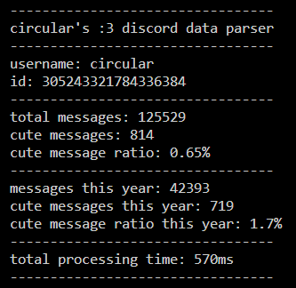

# circular's :3 discord data parser
this script counts how many times youve ever said :3 in discord

you need to download your data package before using

usage: `node index.js /path/to/data/package`

